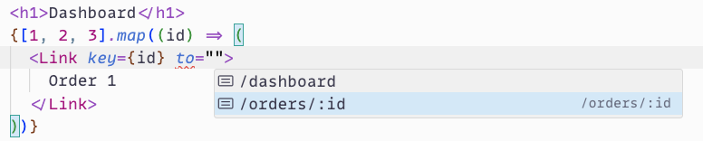
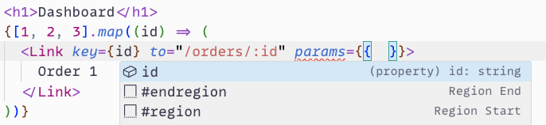
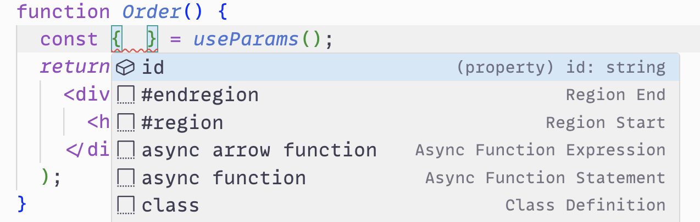

# Senior Frontend Developer Testing Task: Minimalistic React Router

## Setup

```bash
pnpm install    # install dependencies

pnpm run test   # run tests
pnpm run lint   # run linter
pnpm run dev    # run demo app
pnpm run build  # build demo app
```

## Objective

Implement a minimalistic in-memory routing library for React with TypeScript, focusing on type safety and developer experience. The library should provide a simple API for configuring routes, navigating between them, and accessing route parameters.

Please use any resources and tools you need to complete this task. You may research solutions, look up code examples, use development tools, leverage AI assistance etc. At the same time be ready to explain the reasoning behind your technical choices and decisions, as they may be reviewed and discussed.

> 💡 You may change anything in already written code (including suggested API) if it is necessary to meet requirements.

## Requirements

### 1. Core functionality

- Suggest convenient way to configure routing. Configuration should at least contain mappings between paths and components.
- Implement `Router` component to accept routing configuration and manage the routing state. Display correct route based on the path in the router state.
- Implement `Link` component for navigation between routes.
- Implement `useParams` hook to access route parameters from inside routes.
- Handle 404 routes.

### 2. Type-safe `<Link />` component

- Create an intelligent `<Link />` component that provides auto-suggestions for paths.

  

- When path is defined component should auto-suggest required parameters using TypeScript type inference.

  

### 3. Type-Safe route parameters (bonus challenge)

- Ensure route parameters are fully type-safe. For example, if a route expects a `userId` parameter, the `useParams` hook should return object with a `{ userId: string }` type.

  

- Suggest a way to declare in config and narrow route parameters to string, number, enum, etc. It should be possible to receive object with type `{ id: number }` from `useParams` for example. In case of wrong parameter type, route won't match and should not be displayed.

> 💡 You may change `useParams()` hook into any other way to provide route parameters. For example passing parameters as props to route component also would be a valid solution.

### 4. Testing

- Implement integration tests for `<App />` component to ensure proper routing behavior.
- Unit tests for router components and hooks (optional but recommended).

### 5. Performance

- Implement efficient route matching algorithm.
- Prevent unnecessary re-renders.

## Deliverables

1. Source code of the router library
2. Documentation explaining the API and usage (JSDoc comments are sufficient)
3. Test suite or a small demo application showcasing the library's features

## Time allocation

Allocate approximately 4-8 hours for this task. Focus on delivering a working prototype with core features rather than a fully polished result.

## Evaluation criteria

- API design and developer experience
- TypeScript proficiency and type-safety
- Meeting the requirements
- Performance optimizations
- Code quality and organization
- Usage of React best practices

> 💡 Try to meet as many requirements as possible, maintaining high code quality. We're encouraging full completion, however partial completion with high quality is better than poor full implementation.

## Submission

Provide a link to a GitHub repository (or any other VCS) containing your implementation.
